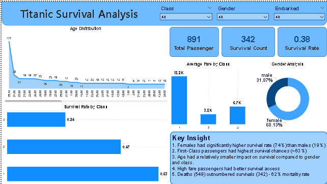
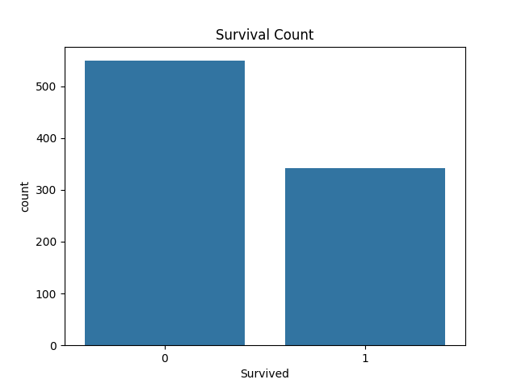
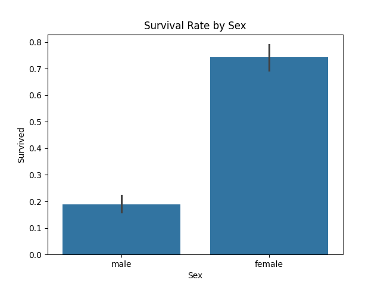
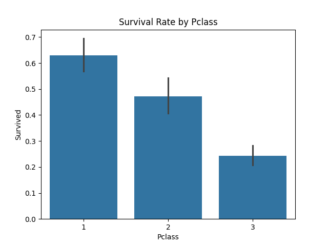
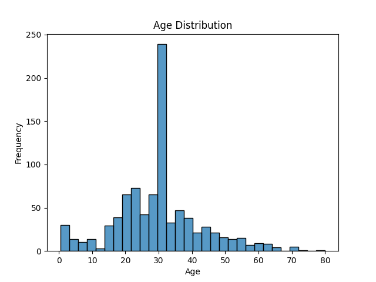

# 🚢 Titanic Survival Analysis 

## 📊 Power BI Dashboard



## 📌 Project Overview

This project performs an in-depth analysis of the Titanic dataset to uncover the key factors that influenced passenger survival. Using Python-based data analysis techniques, we explore patterns related to gender, passenger class, age, and fare.

 

## 🎯 Objective

The goal of this project is to:

* Perform data cleaning and preprocessing
* Conduct exploratory data analysis (EDA)
* Visualize important trends and patterns
* Generate meaningful insights from the data

 

## 🛠️ Tools & Technologies

* Python
* Pandas
* NumPy
* Matplotlib
* Seaborn
* Jupyter Notebook

 

## 📂 Dataset Information

The dataset includes the following features:

* **PassengerId** – Unique ID
* **Survived** – Survival (0 = No, 1 = Yes)
* **Pclass** – Ticket class
* **Name, Sex, Age**
* **SibSp, Parch** – Family members
* **Fare** – Ticket fare
* **Embarked** – Port of embarkation

 

## 🧹 Data Cleaning

The following steps were performed:

* Filled missing values in **Age** using median
* Filled missing values in **Embarked** using mode
* Dropped **Cabin** column due to excessive missing values

 

## 📊 Exploratory Data Analysis (EDA)

### 🔹 Survival Distribution



 

### 🔹 Survival by Gender



 

### 🔹 Survival by Passenger Class



 

### 🔹 Age Distribution



 

## 📈 Key Insights

* Female passengers had a significantly higher survival rate compared to males
* First-class passengers had better survival chances than lower classes
* Higher fare passengers were more likely to survive, indicating better access to rescue
* Younger passengers showed slightly higher survival trends

 

## 📌 Conclusion

The analysis shows that survival on the Titanic was influenced by multiple factors including gender, socio-economic status, and age. Female and first-class passengers were given priority during evacuation, leading to higher survival rates.

 

## 📁 Project Structure

```
titanic-analysis/
│
├── data/
│   └── titanic.csv
│
├── notebook/
│   └── analysis.ipynb
│
├── charts/
│   ├── survival_count.png
│   ├── survival_by_pclass.png
│   ├── survival_by_sex.png
│   └── age_distribution.png
│
└── README.md
```

 

## 💼 Resume Highlight

Performed exploratory data analysis on the Titanic dataset using Python, identifying key factors influencing survival such as gender, passenger class, and fare through data visualization and statistical insights.

 

## 🚀 Future Improvements

* Build a machine learning model to predict survival
* Create an interactive dashboard using Power BI or Streamlit
* Perform advanced feature engineering

 

## ⭐ Acknowledgement

Dataset sourced from Kaggle Titanic Competition.
